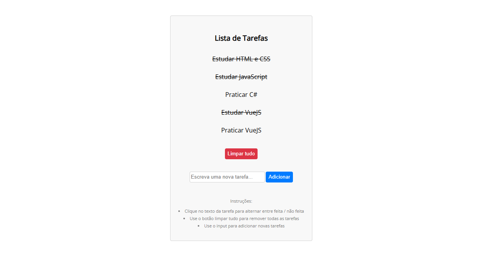

<h1 align="center">Todo List</h1>

  

## 🚀 Tecnologias

Esse projeto foi desenvolvido com as seguintes tecnologias:

- HTML e CSS
- JavaScript
- VueJS

## 💻 Projeto

App web feito de uma simples lista de tarefas feita com VueJS, que adiciona um nova tarefa, pode se alterar o status da mesma, e excluir a lista inteira.

---

Feito com ♥ by Cleber-Risu
